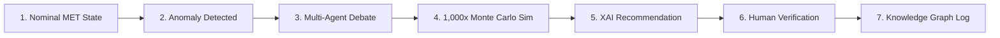
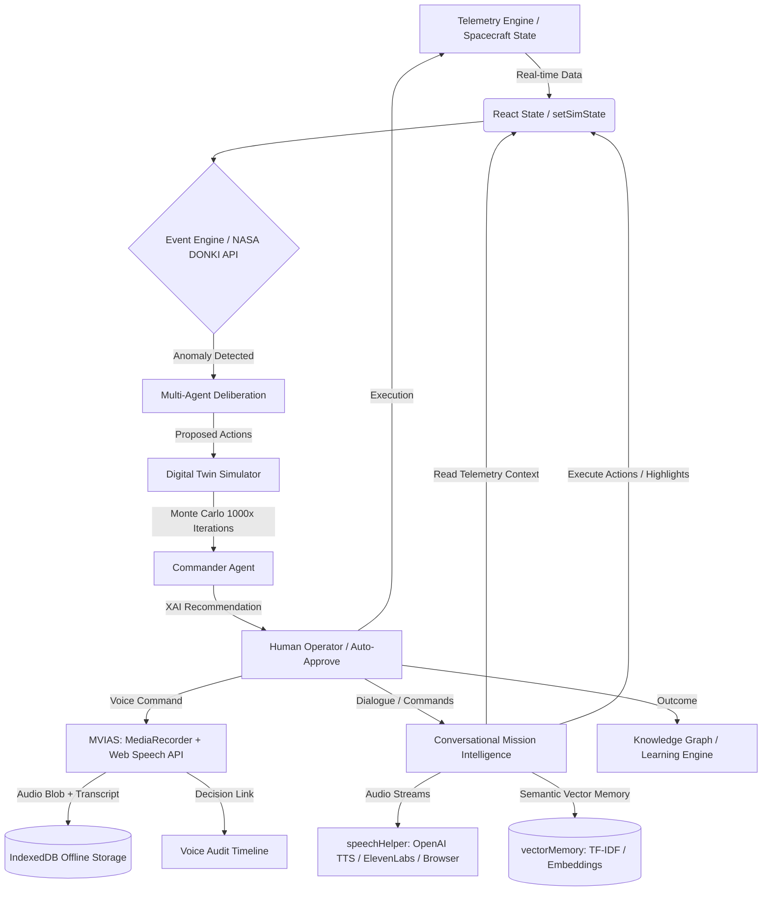
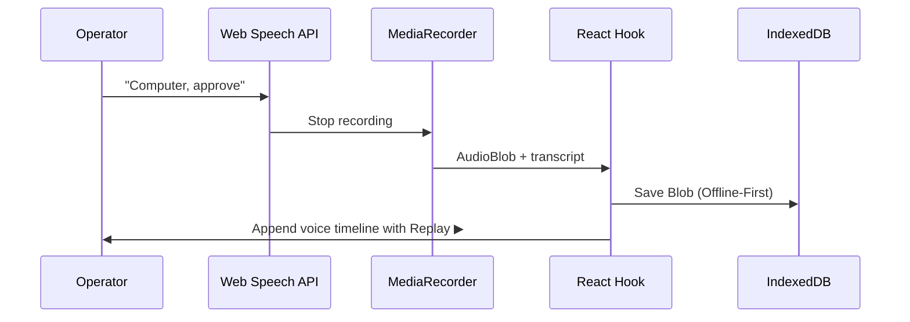

<div align="center">
  
  <br/>
  <h1>🚀 Project HAIL MARY</h1>
  <p><strong>H</strong>euristic <strong>A</strong>rtificial <strong>I</strong>ntelligence <strong>L</strong>ogic for <strong>M</strong>ulti-<strong>A</strong>gent <strong>R</strong>esolution & <strong>Y</strong>ield</p>
  <p><em>An autonomous AI Decision Intelligence Platform for high-risk environments where human reaction time is insufficient.</em></p>

  [](https://reactjs.org/)
  [](https://www.typescriptlang.org/)
  [](https://vitejs.dev/)
  [](https://tailwindcss.com/)
  [](https://docs.pmnd.rs/react-three-fiber/)
  [](https://ai.google.dev/)
</div>

<hr/>

## 📖 Project Overview

**Project HAIL MARY** is a production-grade, multi-agent AI **Decision Intelligence Platform** designed to autonomously govern and protect complex systems during catastrophic failures. Initially modeled around deep-space habitation missions where communication latency prevents real-time human intervention (e.g., Mars), its underlying architecture is a highly generalized engine for critical automated resolution.

### 🌟 Why This Project Stands Out
* **Bypasses Human Bottleneck:** Resolves multi-system telemetry anomalies and reaches optimal safety decisions in milliseconds.
* **Maintains Human Oversight:** Retains absolute governance through granular manual authorization controls, veto capabilities, and role-based overrides.
* **Explainable & Simulated Decisions:** Every AI recommendation is simulated 1,000 times against a sandbox Digital Twin, backed by complete Explainable AI (XAI) rationales and a tamper-resistant voice audit trail.

### 🌍 Real-World Applications Beyond Space
* ☢️ **Nuclear Infrastructure:** Autonomous anomaly resolution and stabilization in reactors.
* 🌊 **Deep-Sea Exploration:** Unmanned submersible navigation and resource allocation.
* 🚑 **Healthcare & Disaster Response:** Real-time triage and emergency resource routing.
* 🚁 **Autonomous Logistics:** Swarm drone management in hazardous weather conditions.

---

## 🎬 Mission Flow (The Demo Story)



1. **Nominal State**: Telemetry runs stable under standard Mission Elapsed Time (MET).
2. **Anomaly**: Catastrophic event occurs (e.g., Solar Flare Strike or Micrometeoroid Impact).
3. **Debate**: Safety, Resource, Navigation, and Science agents debate solutions.
4. **Simulation**: Digital Twin runs 1,000 Monte Carlo runs to evaluate options.
5. **Recommendation**: Commander provides decision, XAI rationale, and risk curves.
6. **Verification**: Flight Director or Commander approves command via voice/UI.
7. **Log**: Execution updates spacecraft telemetry and feeds the Learning Engine.

---

## ✨ Key Features

### 🧠 Core Decision Intelligence
* **Multi-Agent Deliberation:** Specialized LLM agents (Commander, Safety, Resource, Navigation, Science) collaborate and debate to solve anomalies.
* **Explainable AI (XAI):** Decisions are transparently backed by confidence scores, critical risk factors, and evaluated alternatives.
* **Learning Engine & Knowledge Graph:** Stores historical mission outcomes to continuously optimize future heuristic decision weights.

### ⚙️ Sandbox & Simulation Engine
* **Digital Twin Sandbox:** Deep-clones telemetry state in memory ([cloneState.ts](file:///c:/Users/Admin/Desktop/Project%20Hail%20Mary/src/digitalTwin/cloneState.ts)) to safely evaluate action pathways.
* **Monte Carlo Risk Simulation:** Simulates 1,000 iterations per action with randomized environment noise to map risk distributions (*Safe*, *Moderate*, *Critical*).
* **Deterministic Environment Simulator:** Real-time ticks govern fuel burn, oxygen consumption, velocity, and crew morale.

### 🎙️ Mission Voice Intelligence & Audit System (MVIAS)
* **Dual-Track Voice Audit:** Simultaneously captures raw audio blobs (`MediaRecorder`) and speech-to-text transcripts (`Web Speech API`).
* **Offline-First Storage:** Local [idbStorage.ts](file:///c:/Users/Admin/Desktop/Project%20Hail%20Mary/src/utils/idbStorage.ts) caches voice recordings, surviving page refreshes with zero external transmission.
* **Automatic Decision Linking:** Links every operator voice command directly to active Event and Decision IDs for a tamper-resistant chain of custody.

### 🗣️ Conversational Mission Intelligence (CMI)
* **Context-Aware Dialogue:** Live conversation with a NASA-calibrated Commander voice assistant using OpenAI/Gemini APIs.
* **Dashboard Command Execution:** Maps spoken commands (e.g., *"Show fuel status"*) to physical dashboard highlights and triggers.
* **Vector Semantic Memory:** Local vector storage matching queries with OpenAI Embeddings or a custom offline [vectorMemory.ts](file:///c:/Users/Admin/Desktop/Project%20Hail%20Mary/src/utils/vectorMemory.ts).

### 🛡️ Human-Governed Anomaly Command (HGACS)
* **Mandatory Manual Override:** Hardcodes manual decision mode, locking countdowns on safety holds until an authorized role overrides.
* **5-Phase Response Pipeline:** Streamlines triage from *Detection*, *Debate*, *Simulation*, and *XAI* to *Governance & Authorization*.
* **Role-Based Access Control:** Grants custom privileges for `Observer`, `Flight Director`, and `Mission Commander`.

### 🎮 Interface & Interactive Tools
* **3D Spacecraft Command Center:** Interactive React Three Fiber (WebGL) visualizer highlighting subsystem damage.
* **Judge Challenge Mode:** Allows manual injection of "Black Swan" catastrophes (e.g., system fires, micrometeoroid impacts) during presentation.
* **What-If Explorer & Replay:** Tweaks parameters to run digital twin previews and replays historical decision paths.
* **Presentation-Stable Viewports:** Custom scrolling limits telemetry/chat panel scroll actions to local containers, avoiding browser scroll shift.

---

## 🏗️ System Architecture

HAIL MARY operates on a unidirectional data flow governed by a centralized React State structure.



* **Frontend**: React 19, Vite, Tailwind CSS, Framer Motion, `@react-three/fiber` (WebGL).
* **AI Architecture**: Agents are modeled via distinct system prompts fed into the Gemini/OpenAI API via asynchronous hooks.
* **Data Flow**: Pure functional updates ensure the Digital Twin can clone the state perfectly without reference leaks.

---

## 🛠️ Technology Stack

| Layer | Technologies |
| :--- | :--- |
| **Frontend & 3D** | React 19, TypeScript 5+, Vite, React Three Fiber (R3F), Drei, Three.js, Framer Motion |
| **Styling** | Tailwind CSS, CSS Variables, Presentation-Stable Layouts |
| **AI / LLMs** | Google Gemini (`@google/genai`), OpenAI Chat Completions, NASA DONKI API |
| **Voice & Speech** | Web Speech API (Recognition), MediaRecorder, OpenAI TTS (`tts-1`), ElevenLabs |
| **Storage & Memory** | IndexedDB (offline audio storage & local vector DB), TF-IDF Cosine Similarity Fallback |
| **Utilities** | Zustand / React State (`useState`/`useRef`), `jspdf`, `html2canvas`, `lucide-react` |

---

## 📂 Folder Structure

```text
📦 project-hail-mary
 ┣ 📂 src
 ┃ ┣ 📂 components        # Dashboard, ConversationalPanel, CommandCenter3D, MissionVoiceCenter
 ┃ ┣ 📂 digitalTwin       # Sandboxed simulation logic & Monte Carlo engine
 ┃ ┣ 📂 hooks             # useVoiceControl, useVoiceMemory, useCMI
 ┃ ┣ 📂 utils             # idbStorage, vectorMemory, speechHelper
 ┃ ┣ 📄 App.tsx           # Application root
 ┃ ┗ 📄 index.css         # Tailwind & custom styling
```

The core components reside in [src/components](file:///c:/Users/Admin/Desktop/Project%20Hail%20Mary/src/components), with custom hooks in [src/hooks](file:///c:/Users/Admin/Desktop/Project%20Hail%20Mary/src/hooks) and helper utilities in [src/utils](file:///c:/Users/Admin/Desktop/Project%20Hail%20Mary/src/utils).

---

## 🚀 Installation & Setup

### Prerequisites
* Node.js (v18 or higher)
* npm or yarn

### Setup Instructions
1. **Clone & Install:**
   ```bash
   git clone https://github.com/yourusername/project-hail-mary.git
   cd project-hail-mary
   npm install
   ```
2. **Configure Environment:**
   Create a `.env` file in the root directory:
   ```env
   VITE_GEMINI_API_KEY=your_gemini_api_key_here
   VITE_NASA_API_KEY=DEMO_KEY
   ```
   > [!WARNING]
   > Never commit your `.env` file to version control. The `.gitignore` is pre-configured to exclude it.
3. **Run Dev Server:**
   ```bash
   npm run dev
   ```
   *The application will launch at `http://localhost:5173`.*
4. **Build Production Bundle:**
   ```bash
   npm run build
   ```

---

## 🎮 Usage Guide

* **Launch Simulation:** The simulation runs automatically. View the telemetry and MET timer in the header.
* **Inject Anomalies (Judge Challenge):** Click the **Gavel (Judge Challenge)** icon in the header to instantly trigger a catastrophic system event (e.g., Oxygen Leak).
* **Hands-Free Control (Voice):** Click the **Waveform** icon to activate the Mission Voice Center, then speak commands like `"Computer, approve"` or `"HAIL MARY, rerun simulations"`.
* **Explore Simulations:** Click the 3D Spacecraft or the Knowledge Graph panels to visualize live damage and historical decision trees.
* **Audit Trail:** Open the Voice Center to search transcripts, replay recorded operator audio, or download the full audit log.

---

## 🤖 Multi-Agent AI Deliberation System

To reach optimal safety conclusions, five specialized LLM agents debate anomalies in parallel:
* **🎖️ Commander ([commanderAgent.ts](file:///c:/Users/Admin/Desktop/Project%20Hail%20Mary/src/agents/commanderAgent.ts)):** The executive coordinator. Collects agent debates, evaluates Monte Carlo success probabilities, and publishes the final action and XAI rationale.
* **🛡️ Safety ([safetyAgent.ts](file:///c:/Users/Admin/Desktop/Project%20Hail%20Mary/src/agents/safetyAgent.ts)):** Risk-averse agent protecting crew life and hull integrity above all.
* **🔋 Resource ([resourceAgent.ts](file:///c:/Users/Admin/Desktop/Project%20Hail%20Mary/src/agents/resourceAgent.ts)):** Optimizes power, fuel consumption, and systemic resource longevity.
* **🧭 Navigation ([navigationAgent.ts](file:///c:/Users/Admin/Desktop/Project%20Hail%20Mary/src/agents/navigationAgent.ts)):** Evaluates orbital trajectories, velocity, and course corrections.
* **🔬 Science ([scienceAgent.ts](file:///c:/Users/Admin/Desktop/Project%20Hail%20Mary/src/agents/scienceAgent.ts)):** Assesses research goals and ambient environmental hazards.

---

## 🎙️ MVIAS & CMI Technical Architecture

### Voice Audit Pipeline (MVIAS)
The **Mission Voice Intelligence & Audit System (MVIAS)** guarantees compliance and security in high-risk environments:



* **Data Schema:** Automatically tags recordings with `EventID`, `DecisionID`, `timestamp`, `speaker`, `transcript`, and `audioBlobId` for a tamper-resistant chain of custody.
* **Offline-First Storage:** Raw `audio/webm` files are kept in IndexedDB; metadata is managed in memory for instantaneous search.
* **Zero-Trust Security:** Explicit microphone authorization, HTML-escaped text properties, and zero audio data transmitted off-device.

### Conversational Intelligence Flow (CMI)
The **Conversational Mission Intelligence (CMI)** operates a low-latency natural language link with the autopilot:

```text
Voice Input ➔ Speech Recognition ➔ Live Telemetry Context Retrieval ➔ OpenAI/Gemini SSE Stream ➔ Sentence Splitting TTS (ElevenLabs/OpenAI) ➔ Speech Output
```

* **Dashboard Interactivity:** Direct voice triggers execute state modifications (e.g., pausing simulation, generating PDFs, or highlighting telemetry nodes).
* **Dual-Mode Vector DB:** Performs local vector matches using OpenAI Embeddings in IndexedDB, with an automatic offline fallback to a custom TF-IDF cosine-similarity engine.

---

## 🧬 Digital Twin & Monte Carlo Risk Sandbox

The core technical differentiator of HAIL MARY is the **Digital Twin Sandbox**. When an anomaly is detected:
1. **Deep Cloning:** The platform replicates the live spacecraft state (`cloneSpacecraftState()`) into an isolated memory sandbox.
2. **1,000x Monte Carlo Simulation:** The simulation engine executes the proposed actions **1,000 times** in a non-blocking loop, injecting randomized environmental noise (variance `0.85` to `1.15`).
3. **Statistical Analysis:** Outcomes are binned into *Safe* (>75% survival), *Moderate* (40-75%), and *Critical* (<40%) risk curves.
4. **Visual Forecast:** The dashboard renders the statistical likelihood of success to assist human operators in making optimal decisions.

---

## 🛡️ Reliability & Security Protocols

* **Graceful Degradation:** Fallbacks to deterministic, pre-calculated heuristics if API limits are exceeded.
* **LLM Output Sandboxing:** Strictly parses and validates LLM-returned JSON strings before application state mutation.
* **Memory Isolation:** Strict deep-clones prevent simulation runs from bleeding into live state.
* **Offline Resilience:** Procedural events immediately take over if live NASA space weather feeds are unreachable.

---

## 🏆 Hackathon Impact (Judging Matrix)

* 💡 **Innovation:** Implements a dual-track voice solution—an immutable compliance audit log (MVIAS) paired with an interactive real-time assistant (CMI) that modifies dashboard UI elements.
* ⚙️ **Engineering Complexity:** Combines client-side Server-Sent Events (SSE), Web Audio API amplitude trackers, sentence-splitting audio streams, IndexedDB vector storage, and local TF-IDF similarity engines.
* 🌍 **Real-World Utility:** Practical design for hands-free, high-stress environments (e.g., flight decks, surgical units, disaster centers) where typing is impossible.
* 🔍 **Explainable AI:** Allows the user to ask the CMI *"Why did we choose this action?"* to pull simulation curves from the history log.
* 🎨 **Stunning UX:** Visual waveform orb responding to voice amplitude, live status ticks, responsive layouts, and presentation-stable viewports.

---

## 🔮 Future Enhancements

* **Distributed Backend:** Connect to a Node.js/Redis cluster for multi-operator sync.
* **Persistent Knowledge Graph:** Integrate Neo4j/pgvector for long-term historical anomaly mapping.
* **Hardware Integration:** Interface with IoT systems (e.g., physical telemetry sensors).

---

## 📜 License

This project is licensed under the MIT License.

---

## 🙏 Acknowledgements

* [Google Gemini](https://deepmind.google/technologies/gemini/) & [OpenAI](https://openai.com/) for LLM intelligence.
* [NASA DONKI API](https://ccmc.gsfc.nasa.gov/tools/DONKI/) for space weather data.
* [React Three Fiber](https://docs.pmnd.rs/react-three-fiber/) for WebGL browser rendering.

---

<div align="center">
  <p><em>"Survival is not about reacting fast enough. It is about predicting the failure before it happens."</em></p>
  <strong>Project HAIL MARY</strong>
</div>
