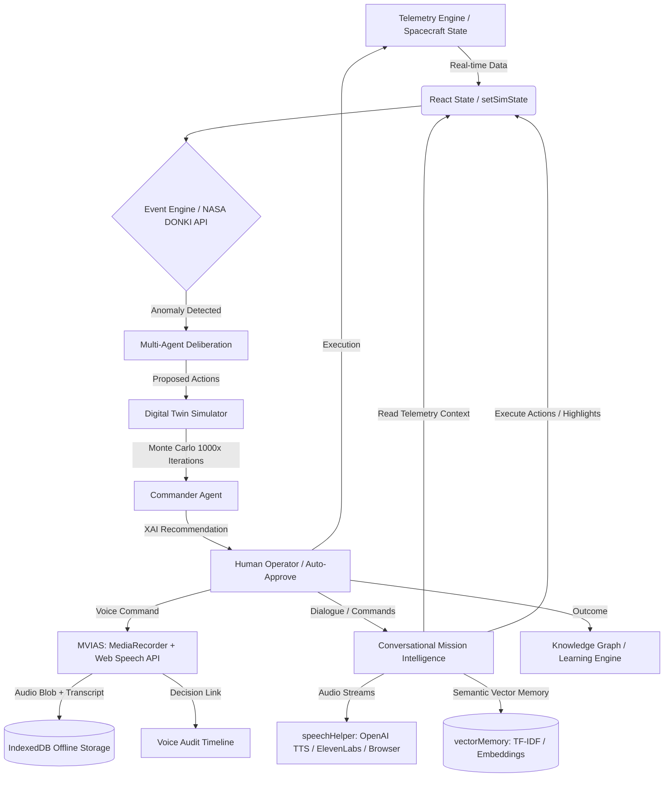

<div align="center">
  
  <br/>
  <h1>🚀 Project HAIL MARY</h1>
  <p><strong>H</strong>euristic <strong>A</strong>rtificial <strong>I</strong>ntelligence <strong>L</strong>ogic for <strong>M</strong>ulti-<strong>A</strong>gent <strong>R</strong>esolution & <strong>Y</strong>ield</p>
  <p><em>An autonomous AI Decision Intelligence Platform for high-risk environments where human reaction time is insufficient.</em></p>

  [](https://reactjs.org/)
  [](https://www.typescriptlang.org/)
  [](https://vitejs.dev/)
  [](https://tailwindcss.com/)
  [](https://docs.pmnd.rs/react-three-fiber/)
  [](https://ai.google.dev/)
</div>

<hr/>

## 📖 Project Overview

**Project HAIL MARY** is a production-grade, multi-agent AI **Decision Intelligence Platform** designed to autonomously govern and protect complex systems during catastrophic anomalies. Initially modeled around deep-space habitation missions where communication latency (e.g., 20+ minutes to Mars) prevents real-time human intervention, its underlying architecture is highly generalized for critical automated resolution.

The platform processes complex telemetry stream anomalies and reaches optimal safety decisions in milliseconds, ensuring that every choice is mathematically simulated, explainable (XAI), and human-governed.

---

## 🌟 Why This Project Stands Out

* **Bypasses the Human Bottleneck:** Resolves multi-system telemetry anomalies and determines optimal recovery actions in milliseconds.
* **Guarantees Human Governance:** Implements a strict manual override system (HGACS), locking execution loops on safety holds until confirmed by authorized roles.
* **Explainable & Simulated Safety:** Prior to execution, every recommendation is simulated 1,000 times against a sandbox Digital Twin, generating statistical risk curves and natural language rationales (XAI).
* **Robust Offline Capabilities:** Designed with an offline-first storage and indexing architecture, allowing local transcription, voice synthesis queueing, and semantic database queries to survive network blackouts.
* **Cross-Industry Application:** Easily transfers to terrestrial high-risk environments including nuclear reactors, deep-sea exploration, disaster response triage, and autonomous logistics swarms.

---

## ✨ Key Features

### 🧠 Core Decision Intelligence
* **Multi-Agent Deliberation:** Specialized LLM agents (Commander, Safety, Resource, Navigation, Science) collaborate and debate to solve anomalies.
* **Explainable AI (XAI):** Backs all decisions with confidence metrics, critical contributing factors, and evaluated alternatives.
* **Learning Engine & Knowledge Graph:** Stores historical mission outcomes to continuously optimize future heuristic decision weights.

### ⚙️ Sandbox & Simulation Engine
* **Digital Twin Sandbox:** Deep-clones live telemetry state in memory ([cloneState.ts](file:///c:/Users/Admin/Desktop/Project%20Hail%20Mary/src/digitalTwin/cloneState.ts)) to safely test recovery routes.
* **Monte Carlo Risk Engine:** Simulates 1,000 runs per action with injected noise to calculate precise statistical risk bounds.
* **Deterministic Environment Simulator:** Real-time ticks govern fuel burn, oxygen consumption, velocity, and crew morale.

### 🎙️ Mission Voice & Conversational AI
* **Dual-Track Voice Audit (MVIAS):** Simultaneously captures raw audio blobs (`MediaRecorder`) and speech-to-text transcripts (`Web Speech API`), stored offline in IndexedDB ([idbStorage.ts](file:///c:/Users/Admin/Desktop/Project%20Hail%20Mary/src/utils/idbStorage.ts)).
* **Audit Chain of Custody:** Automatically links operator voice recordings to active Event and Decision IDs for compliance.
* **Conversational Assistant (CMI):** Natural language dashboard interaction via a NASA-calibrated Commander voice using OpenAI/Gemini APIs and local vector memory ([vectorMemory.ts](file:///c:/Users/Admin/Desktop/Project%20Hail%20Mary/src/utils/vectorMemory.ts)).

### 🛡️ Human-in-the-Loop Governance (HGACS)
* **Mandatory Manual Override:** Hardcodes manual decision mode, locking countdowns on safety holds until an authorized role overrides.
* **5-Phase Response Pipeline:** Streamlines triage from *Detection*, *Debate*, *Simulation*, and *XAI* to *Governance & Authorization*.
* **Role-Based Access Control:** Grants custom privileges for `Observer`, `Flight Director`, and `Mission Commander`.

### 🎮 Interface & Interactive Tools
* **3D Visualizer Command Center:** WebGL model of the spacecraft highlighting real-time telemetry damage using React Three Fiber.
* **Judge Challenge Mode:** Instant manual injection of "Black Swan" catastrophes during live presentations.
* **Presentation-Stable Viewports:** Custom scrolling limits telemetry/chat panel scroll actions to local containers, avoiding browser scroll shift.

---

## 🏗️ System Architecture

Project HAIL MARY utilizes a unidirectional data flow built on a centralized React state loop.



* **Frontend**: React 19, Vite, Tailwind CSS, Framer Motion, `@react-three/fiber` (WebGL).
* **AI Architecture**: Specialized LLM agents ([commanderAgent.ts](file:///c:/Users/Admin/Desktop/Project%20Hail%20Mary/src/agents/commanderAgent.ts), [safetyAgent.ts](file:///c:/Users/Admin/Desktop/Project%20Hail%20Mary/src/agents/safetyAgent.ts)) run in parallel using asynchronous prompt engineering hooks.
* **Data Flow**: Pure functional state clones guarantee sandbox isolation without mutating live state.

---

## 🛠️ Technology Stack

| Layer | Technologies |
| :--- | :--- |
| **Frontend & 3D** | React 19, TypeScript 5+, Vite, React Three Fiber (R3F), Drei, Three.js, Framer Motion |
| **AI & LLMs** | Google Gemini (`@google/genai`), OpenAI Chat Completions, NASA DONKI API |
| **Voice & Speech** | Web Speech API, MediaRecorder, OpenAI TTS (`tts-1`), ElevenLabs, [speechHelper.ts](file:///c:/Users/Admin/Desktop/Project%20Hail%20Mary/src/utils/speechHelper.ts) |
| **Storage & Memory** | IndexedDB (audio storage & local vector DB), TF-IDF Cosine Similarity Fallback |
| **Utilities** | Zustand / React State, `jspdf`, `html2canvas`, `lucide-react` |

---

## 🚀 Installation & Run Commands

### Prerequisites
* Node.js (v18 or higher)
* npm or yarn

### Setup Instructions
1. **Clone & Install:**
   ```bash
   git clone https://github.com/yourusername/project-hail-mary.git
   cd project-hail-mary
   npm install
   ```
2. **Configure Environment:**
   Create a `.env` file in the root directory:
   ```env
   VITE_GEMINI_API_KEY=your_gemini_api_key_here
   VITE_NASA_API_KEY=DEMO_KEY
   ```
   > [!WARNING]
   > Never commit your `.env` file to version control. The `.gitignore` is pre-configured to exclude it.
3. **Run Dev Server:**
   ```bash
   npm run dev
   ```
   *The application will launch at `http://localhost:5173`.*
4. **Build Production Bundle:**
   ```bash
   npm run build
   ```

---

## 🧬 Digital Twin & Monte Carlo Risk Sandbox

The core technical differentiator of HAIL MARY is its sandboxed evaluation loop:
1. **Deep Cloning:** Telemetry states are duplicated into an isolated memory workspace via `cloneSpacecraftState()`.
2. **1,000x Simulation:** Runs the proposed action 1,000 times in a non-blocking loop via [simulateAction.ts](file:///c:/Users/Admin/Desktop/Project%20Hail%20Mary/src/digitalTwin/simulateAction.ts), injecting randomized environmental variance (`0.85` to `1.15`).
3. **Risk Mapping:** Forecasts the likelihood of survival, binning outcomes into *Safe* (>75% survival), *Moderate* (40-75%), and *Critical* (<40%) risk curves.
4. **Visual Delivery:** Renders real-time statistical curves on the operator's dashboard to assist human operators in making optimal decisions.

---

## 🏆 Hackathon Impact (Judging Matrix)

* 💡 **Innovation:** Dual-track voice integration—an immutable compliance audit trail (MVIAS) paired with a conversational dashboard controller (CMI) that executes highlights and views.
* ⚙️ **Technical Complexity:** Combines client-side Server-Sent Events (SSE), Web Audio API amplitude tracks, browser IndexedDB vector storage, and offline TF-IDF fallback similarity engines.
* 🌍 **Real-World Utility:** Practical design for hands-free, high-stress environments (e.g., flight decks, surgery units, disaster response control centers) where manual inputs are slow or impossible.
* 🔍 **Explainable AI:** Operators can query CMI directly about historical decisions, retrieving exact Monte Carlo curves and agent debates from memory.
* 🎨 **Exceptional UX:** Interactive WebGL spacecraft model, responsive layouts, voice waveform amplitude visualizer, and presentation-stable viewports that prevent scroll shift during live runs.

---

## 🔮 Future Enhancements

* **Distributed State:** Integrate Redis/WebSockets for multi-user synchronization and remote control rooms.
* **Persistent Knowledge Graph:** Connect Neo4j/pgvector for long-term historical anomaly pattern analysis.
* **Hardware Integration:** Connect live rover telemetry and IoT sensor hardware interfaces.

---

## 📜 License

This project is licensed under the MIT License.
